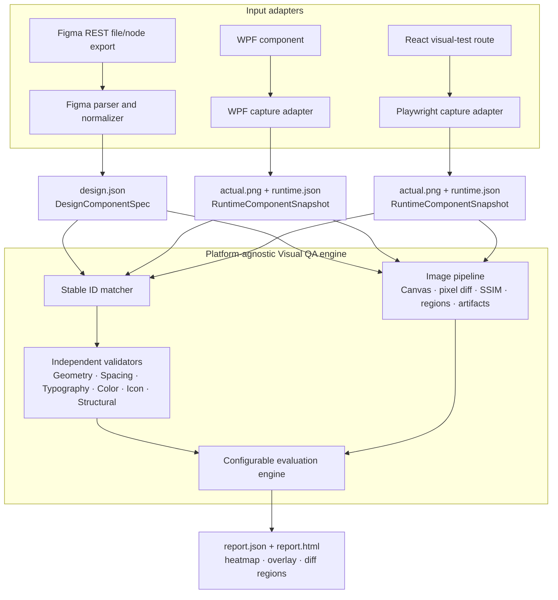
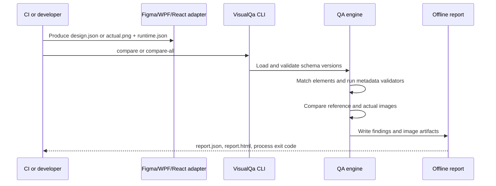

# Visual QA architecture

## Purpose

Visual QA verifies whether a rendered UI conforms to a Figma design without AI, OCR, cloud visual analysis, or image-based property inference. It gives structured metadata priority over visual comparison, then uses deterministic pixel analysis as additional evidence.

## Components and boundaries

### Platform adapters

Figma, WPF, and React are adapters only. They are responsible for converting their native data into the common contracts; neither the comparison engine nor reporting code contains WPF or browser-specific rules.

- `VisualQa.Figma` exposes parsing and normalization of a local Figma REST export into `DesignComponentSpec`. The calling application must serialize that result to `design.json`; no import CLI command is implemented yet.
- `VisualQa.WpfCapture` provides `RenderTargetBitmap` rendering and a visual-tree metadata collector. The calling WPF test host must invoke both for the same component instance. It is Windows-only.
- `react-capture` uses Playwright, `data-qa`, DOM bounds, and computed CSS to create an equivalent runtime snapshot. It is portable wherever Chromium can run.

### Common contracts

`VisualQa.Core` owns versioned (`schemaVersion`) design and runtime models. Both captures write `RuntimeComponentSnapshot`; therefore new platforms only need a new capture adapter that produces `actual.png` and `runtime.json`.

The matcher uses exact QA IDs first, then normalized names, roles, text, and type plus approximate position. WPF uses `VisualQa.Id`; React uses `data-qa`. Missing information becomes an evidenced `NotEvaluated` finding instead of silently disappearing.

### Comparison and policy

The current CLI invokes structural, geometry, spacing, typography, and icon validators. Color threshold models exist in configuration, but a dedicated Delta-E color validator is not yet wired into the CLI. Pixel comparison produces an overlay, heatmap, diff image, connected mismatch regions, and global SSIM evidence. It can use bounded translation-only alignment when enabled; it never scales, rotates, warps, or perspective-corrects screenshots.

## Execution flow

Exit code `0` means pass, `1` means QA failures, and `2` means invalid input, unsupported schema, or a system/configuration error.

## Operating-system support

- `VisualQa.CrossPlatform.sln` builds the CLI, core, image processing, Figma normalization, reporting, and tests on Windows, macOS, and Linux.
- `VisualQa.sln` additionally contains `VisualQa.WpfCapture` and is the Windows build entry point.
- macOS and Linux can run Figma-to-React comparisons and compare already-generated WPF artifacts. They cannot perform WPF capture.

## CI recommendation

Use Windows with fixed DPI, controlled fonts, a predictable theme, and a pinned Chromium release when WPF capture is required. The job sequence is: build, capture, compare, publish `results`, and return the CLI exit code. For React-only validation, use the cross-platform solution on the desired operating system with a pinned Playwright browser.

## Extension rule

To add Angular, Vue, WinUI, MAUI, Flutter, or Qt, create an adapter that produces the versioned runtime contract and screenshot. Do not add platform-specific branches to `VisualQa.Core` or the comparison engine.
