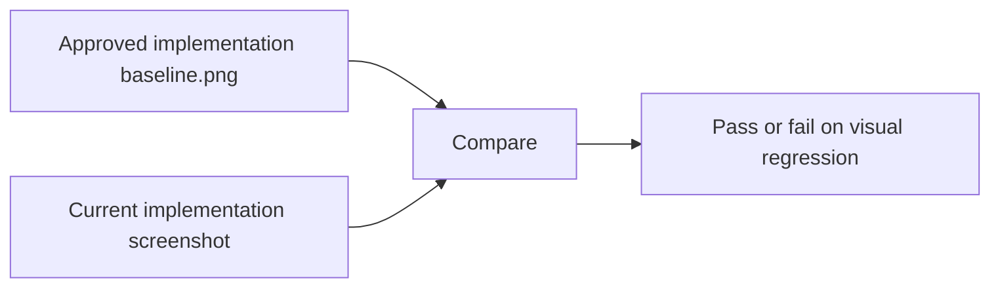
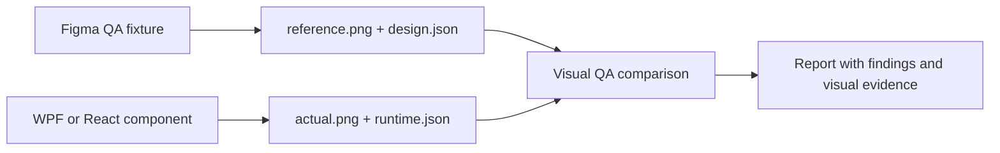
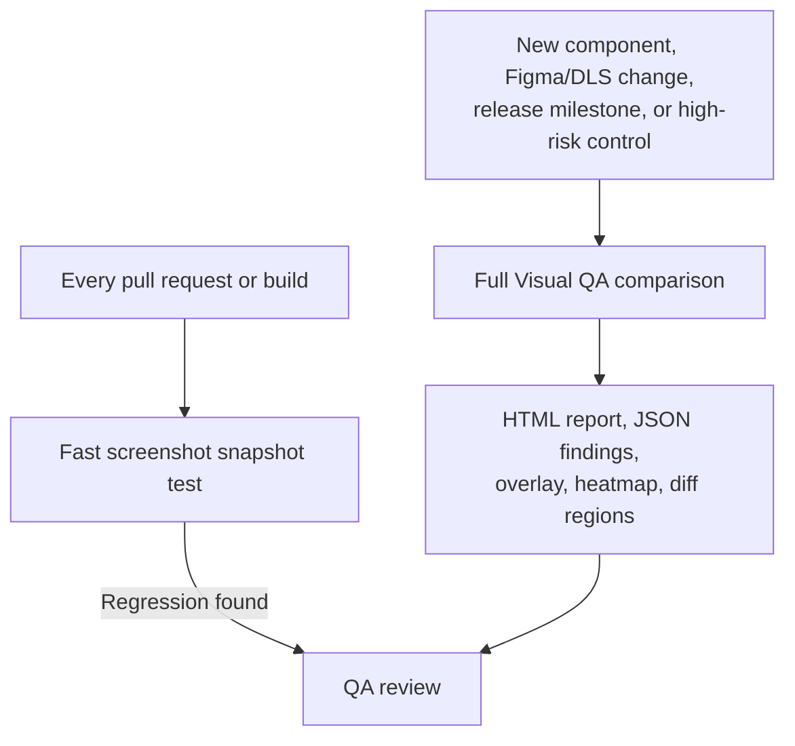

# Snapshot testing versus Visual QA

## The short answer

Snapshot testing and Visual QA solve different problems. They work best together.

```text
Snapshot testing protects implementation stability.
Visual QA protects design conformance.
```

## Snapshot testing

Screenshot snapshot testing compares the current implementation against a previously approved implementation screenshot.



It answers:

> Did the implementation visibly change from its last approved state?

It is fast and valuable for every pull request or build. However, its baseline is the previous implementation, not the approved Figma design.

If the original implementation used the wrong font, padding, icon, or DLS token, snapshot testing can keep approving that error as long as it remains unchanged.

## Visual QA

Visual QA compares the approved design fixture with the implementation.



It answers:

> Does the implementation conform to the approved design, and what is likely different?

Image evidence identifies visible differences. Structured design and runtime metadata can identify likely causes such as:

- a missing element;
- incorrect text;
- position or size deviation;
- font family, size, or weight mismatch;
- colour or token mismatch;
- incorrect icon metadata;
- spacing or alignment deviation.

## Why snapshot testing alone is not enough

```text
Approved snapshot baseline = “do not change what we previously built.”
Approved Figma fixture     = “implement the intended design correctly.”
```

These are not always the same thing. A stable but incorrect implementation can pass snapshot testing indefinitely. Visual QA detects drift between the design system and the implementation.

This matters most for shared controls such as buttons, inputs, tabs, navigation, dialogs, cards, and tables. A design mistake in one shared component can affect many products.

## Recommended operating model



Use screenshot snapshot testing:

- on every pull request or build;
- for fast implementation regression detection;
- for broad coverage with minimal setup.

Use full Visual QA:

- when delivering a new shared component;
- when Figma or DLS changes;
- before release milestones;
- for high-risk or frequently reused controls;
- when a screenshot diff needs a more useful diagnosis.

## Scope Visual QA deliberately

Do not create full metadata fixtures for every low-risk control on day one. Start with priority design-system controls and prove the value with real QA feedback.

```text
Phase 1: Image-only comparison for priority controls.
Phase 2: Dedicated Figma QA fixtures for those controls.
Phase 3: Runtime metadata and explainable structured findings.
Phase 4: Promote proven rules to controlled CI gates.
```

The image-only `compare-images` command is a useful first step. The richer `compare` and `compare-all` workflows should be introduced after matching Figma fixtures, WPF runtime capture, and thresholds have been validated with real components.

## Conclusion

Keep snapshot testing as the everyday regression safety net. Use Visual QA as the design-conformance and diagnostic layer. Together they provide faster feedback, stronger design-system governance, and better evidence for QA, design, and development discussions.
