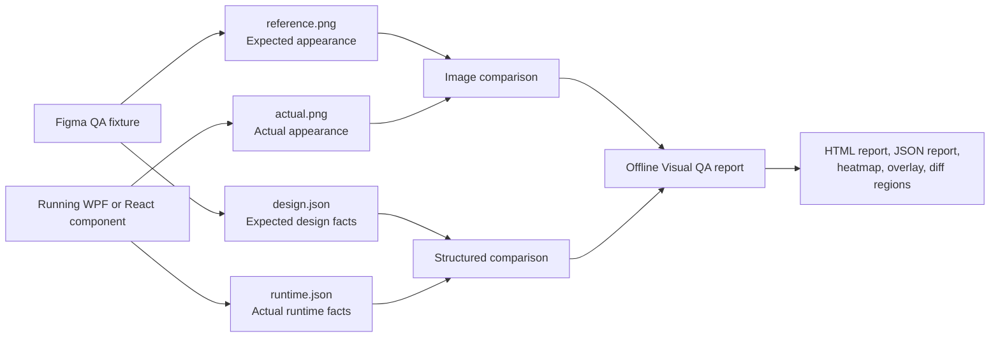
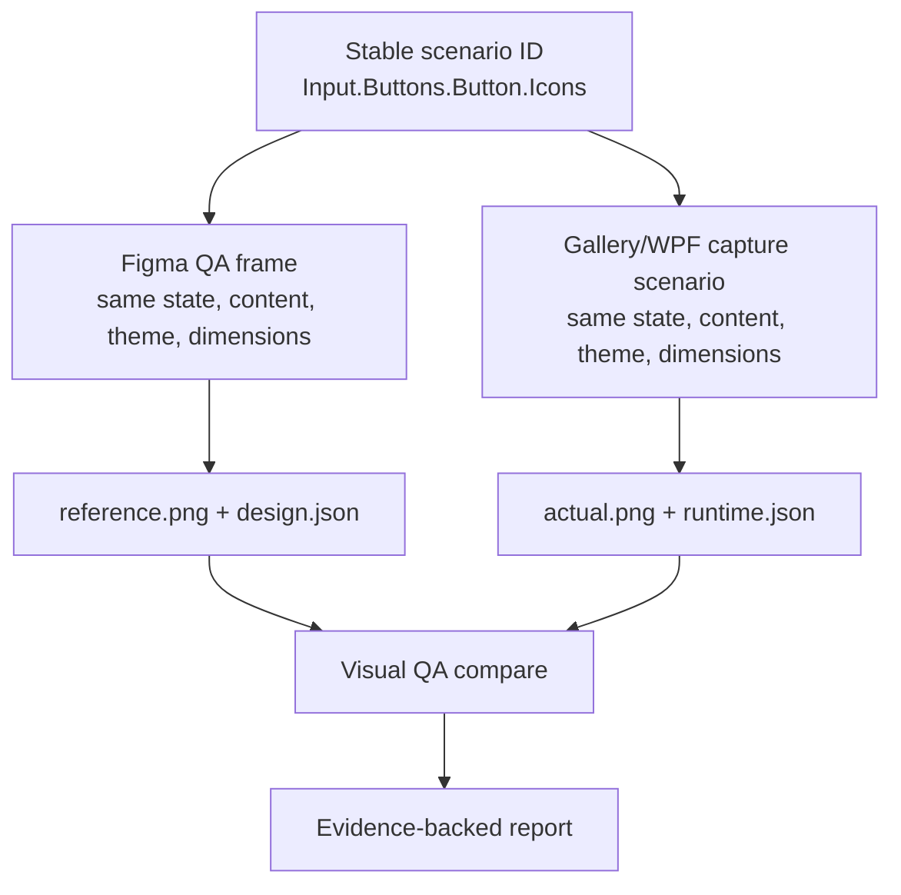
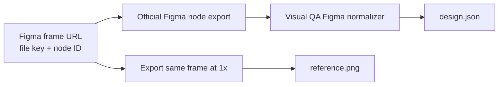
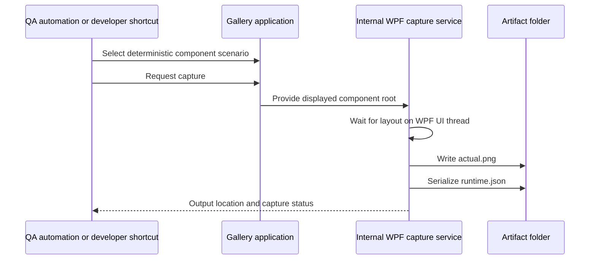
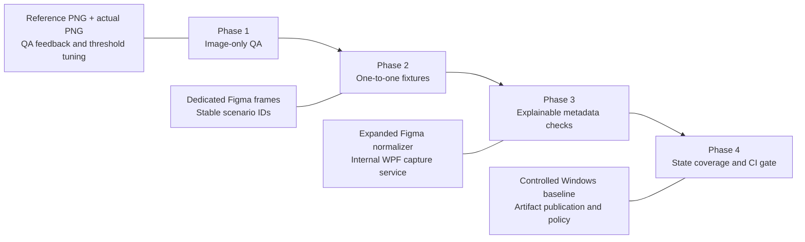
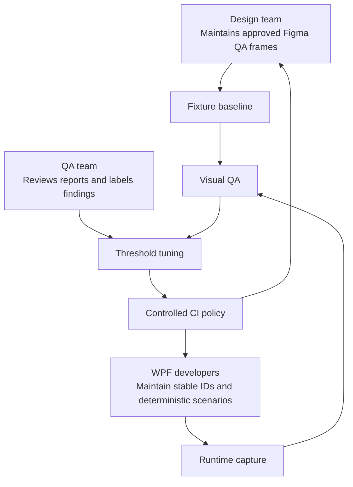

# Visual QA strategy

## Purpose

Visual QA turns a subjective review question—"does the WPF implementation match the design?"—into repeatable evidence.

It compares a controlled Figma design fixture with the corresponding controlled WPF or React implementation capture. The outcome is an offline report containing findings and visual evidence that designers, developers, and QA can review together.

This is an evaluation-phase solution. The image-only workflow is the currently proven QA capability. The richer Figma-to-WPF/React workflow is implemented as an MVP and must be validated and tuned with real Gallery components before it becomes a CI quality gate.

## The core idea

Image comparison answers **whether the rendered UI looks different**. Structured metadata comparison answers **which element or style value likely differs**.



Neither layer replaces the other:

- Screenshot comparison can show a visibly wrong button or icon, but cannot reliably say which token, font family, padding value, or resource caused it.
- Metadata comparison can identify a likely font, text, position, or colour mismatch, but does not replace visual evidence of rasterization, clipping, shadow, or rendering differences.

## Required one-to-one fixture model

Automation is reliable only when the Figma design and Gallery capture represent the same scenario.



Examples of separate scenarios are:

```text
Input.Buttons.Button.Default
Input.Buttons.Button.Icons
Input.Buttons.Button.Disabled
Input.Buttons.Button.Hover
Input.Buttons.Button.Focus
```

These do not need separate full Figma pages. They can be dedicated frames on a single Visual QA page. Each frame must represent exactly one Gallery capture scenario.

Do not compare a whole Figma component-library page with a single Gallery example. Surrounding content, layout, variants, and page coordinates make results noisy and misleading.

## Inputs for one WPF comparison

```text
visual-tests/
  <ComponentScenarioId>/
    design/
      reference.png        Figma export of the exact QA frame
      design.json          normalized expected design contract
    wpf/
      actual.png           WPF capture of the equivalent root
      runtime.json         WPF visual-tree metadata from that same root
```

The screenshots must have the same intended component crop, dimensions, theme, background, test data, state, and font environment. Visual QA never scales, rotates, warps, or perspective-corrects screenshots to make them match.

## How `design.json` is produced

The source is an official local Figma REST export for the selected QA frame—not a whole Figma page and not only a token-selection payload.



The raw Figma export can provide expected text, typography, fills, strokes, bounds, auto-layout padding/gaps, corner radius, effects, variants, and many icon references. The Visual QA normalizer must convert these values into component-root-relative coordinates and stable IDs that match the implementation.

For example, Figma and WPF should deliberately use the same meaningful ID:

```text
Figma layer / normalized ID: icons-button-01
WPF VisualQa.Id:             icons-button-01
```

## How `runtime.json` is produced

`runtime.json` is created from the real, running WPF component. It records actual bounds, text, typography, colours where available, margin, padding, visibility, DPI, and environment information for elements marked with `VisualQa.Id`.

The scalable model is an internal, test-only Gallery capture service rather than custom capture code inside every component.



The capture service must be enabled only in internal QA/developer environments. It must not expose a production network endpoint or capture uncontrolled end-user UI data.

## Checklist coverage strategy

The WPF Visual QA checklist has two different kinds of work.

### Visual conformance: automate progressively

With a dedicated Figma fixture, `design.json`, `runtime.json`, and screenshots, Visual QA can progressively automate:

- Typography: font family, size, weight, text, line height, letter spacing, and alignment.
- Colours: component surface, text, border, icon, and state colours.
- Spacing and shape: padding, gaps, dimensions, borders, radius, dividers, shadows, and elevation.
- Layout and assets: element alignment, icon identity/position, wrapping, overflow, RTL fixtures, and image quality.
- States: default, selected, hover, pressed, focus, disabled, error, loading, and empty states.
- Rendering: expected size, controlled DPI, and raster visual comparison.

Not every field is currently present in the normalized contracts or validators. The planned contract additions are:

```text
textAlignment
padding and gap
borderColor, borderWidth, borderStyle
cornerRadius
effects and shadows
iconName and iconBounds
wrapping and clipping metadata
state/variant and RTL direction
```

### Behaviour: use UI automation

Figma describes expected appearance, not runtime behaviour. Keep behaviour tests in a WPF UI-automation suite:

- Click/tap action.
- Select/deselect and toggle behaviour.
- Expand/collapse.
- Scrolling and drag/drop where applicable.
- Rapid/repeated interaction.
- Dismiss/close with Escape or outside click.

Visual QA can capture the appearance of a resulting state, but it does not prove that the interaction causing that state works.

## Delivery phases



### Phase 1: Image-only QA

Use `compare-images` to compare an approved PNG against the implementation PNG. This is cross-platform and already suitable for QA evaluation.

### Phase 2: Fixture alignment

Create matching Figma QA frames for priority Gallery scenarios. Pin test data, dimensions, fonts, theme, and state. Establish stable IDs across Figma and WPF.

### Phase 3: Explainable comparison

Enhance the Figma normalizer and WPF capture contract with the additional checklist fields. Validate `compare` on real Gallery controls and tune `visualqa.json` from observed false positives and false negatives.

### Phase 4: Controlled CI quality gate

Run capture and comparison on a pinned Windows baseline for WPF. Publish reports as CI artifacts. Promote selected checks from warning to blocking only after the fixture and thresholds are proven stable.

## Operating model



The report is evidence, not an automatic replacement for human judgement. QA should use real component samples to classify findings as true positives, false positives, or acceptable deviations. That feedback controls threshold changes and determines when a rule is safe to block in CI.

## Success criteria

The strategy is succeeding when:

- Each priority Gallery scenario has an equivalent Figma QA frame.
- Captures are deterministic and repeatable on the controlled baseline.
- Reports identify meaningful deviations with useful visual evidence.
- QA can tune policy through `visualqa.json` rather than changing code for every tolerance decision.
- False-positive and false-negative rates are measured using real component samples.
- Only proven, stable checks are used as CI blockers.

## Scope boundaries

- Image-only comparison works without Figma JSON or runtime metadata.
- WPF capture is Windows-only because WPF is Windows-only.
- The image-only CLI can run on Windows, macOS, and Linux after screenshots have been captured.
- Visual QA does not use AI, OCR, or cloud visual analysis.
- The current solution does not compare WPF directly with React; each is compared separately against the design fixture.
